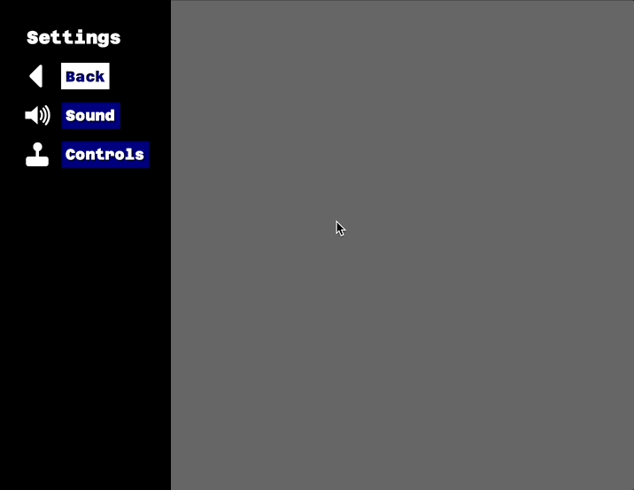

# Bevy Quickmenu (in-development)

- Simple menu plugin for bevy. This is particular useful for settings or menu screens.
- Automatically works with keyboard, mouse, and gamepad.
- Has additional helpers for quickly building control-selection screens (e.g. keyboard or gamepad).
- Very simple with little flexibility
- Build-in stylesheet system which allows you to change the looks of the menu
- Currently (temporarily) requires `bevy 0.9-dev` and `bevy_egui` dev. So if you want to use it you'll have to clone it

# Example



# Usage

[`examples/settings.rs` has a good example](examples/settings.rs). Here's an explanation of the required components:

## `State`

A generic type that hosts the state of your menu (e.g. which items are selected, and so on)

## `Action`

(Conforms to `ActionTrait`): This enum defines all the actions your user can take. Such as `SoundOn`, `SoundOff` etc. When a user performs an action (by selecting the corresponding menu entry), the `handle` method is called on your `ActionTrait` implementation. `ActionTrait` has two generic types: Your `State` as well as a `Event` which you can define. This allows you to handle your action:

``` rs
#[derive(Debug, PartialEq, Eq, Clone, Copy, Hash)]
enum Actions {
    Close,
    SoundOn,
    SoundOff,
    Control(usize, ControlDevice),
}

impl ActionTrait for Actions {
    type State = CustomState;
    type Event = MyEvent;
    fn handle(&self, state: &mut CustomState, event_writer: &mut EventWriter<MyEvent>) {
        match self {
            Actions::Close => event_writer.send(MyEvent::CloseSettings),
            Actions::SoundOn => state.sound_on = true,
            Actions::SoundOff => state.sound_on = false,
            Actions::Control(p, d) => {
                state.controls.insert(*p, *d);
            }
        }
    }
}
```

## `Screen`

(Conforms to the `ScreenTrait`). Each page or screen in your menu is defined by this enum. Note that menu screens are *not nested*!. Instead the `ScreenTrait` has a `resolve` function that allows you to return the corresponding menu definition for the given enum:

``` rs
#[derive(Debug, PartialEq, Eq, Clone, Copy, Hash)]
enum Screens {
    Root,
    Controls,
    Sound,
    Player(usize),
}

impl ScreenTrait for Screens {
    type Action = Actions;
    fn resolve(&self, state: &mut CustomState) -> Menu<Actions, Screens, CustomState> {
        match self {
            Screens::Root => root_menu(state),
            Screens::Controls => controls_menu(state),
            Screens::Sound => sound_menu(state),
            Screens::Player(p) => player_controls_menu(state, *p),
        }
    }
}
```

## `Menu`

A menu is just a function that returns a list of `MenuItem` to be displayed. Each menu needs to have a distinct id. The example shows how the `root` and the `sound` menu are defined.

``` rs
fn root_menu(_state: &mut CustomState) -> Menu<Actions, Screens, CustomState> {
    Menu {
        id: Id::new("root"),
        entries: vec![
            MenuItem::headline("Settings"),
            MenuItem::action("Back", Actions::Close).with_icon(MenuIcon::Back),
            MenuItem::screen("Sound", Screens::Sound).with_icon(MenuIcon::Sound),
            MenuItem::screen("Controls", Screens::Controls).with_icon(MenuIcon::Controls),
        ],
    }
}

fn sound_menu(state: &mut CustomState) -> Menu<Actions, Screens, CustomState> {
    Menu {
        id: Id::new("sound"),
        entries: vec![
            MenuItem::label("Toggles sound and music"),
            MenuItem::action("On", Actions::SoundOn).checked(state.sound_on),
            MenuItem::action("Off", Actions::SoundOff).checked(!state.sound_on),
        ],
    }
}
```

## `MenuItem`

In order to give you *some* flexibility, the menu item allows you to return four different types:

- `MenuItem::label`: A small text label that cannot be selected
- `MenuItem::headline`: A big text label that cannot be selected
- `MenuItem::action`: A action that is performed when the user selects it
- `MenuItem::screen`: Dive into a screen when the user selects this

## Setup

Most importantly, the setting will appear or disappear depending on the existence of the `SettingsState` resource:

``` rs
/// Show the menu
commands.insert_resource(SettingsState::new(MyState::default, Screens::Root, None)))
```

``` rs
/// Hide the menu
commands.remove_resource::<SettingsState<MyState, Actions, Screens>>();
```

Here's a the annoated setup function from the example:

``` rs
impl Plugin for SettingsPlugin {
    fn build(&self, app: &mut App) {
        // Create a default stylesheet. You can customize these as you wish
        let sheet = Stylesheet::default();
        // If you want to load a custom font, insert the `CustomFontData` resource
        app.insert_resource(CustomFontData(Some(FONT_DATA)))
        // The settings state that will be handed to menus, screens and actions.
        // If you remove this resource, the menu will disappear
            .insert_resource(SettingsState::new(
                CustomState {
                    sound_on: true,
                    gamepads: Vec::new(),
                },
                Screens::Root,
                Some(sheet),
            ))
            // Register a event that can be called from your action handler
            .add_event::<MyEvent>()
            // The plugin
            .add_plugin(QuickMenuPlugin::<CustomState, Actions, Screens>::default())
            // Some systems
            .add_system(event_reader)
            .add_system(update_gamepads_system);
    }
}
```
