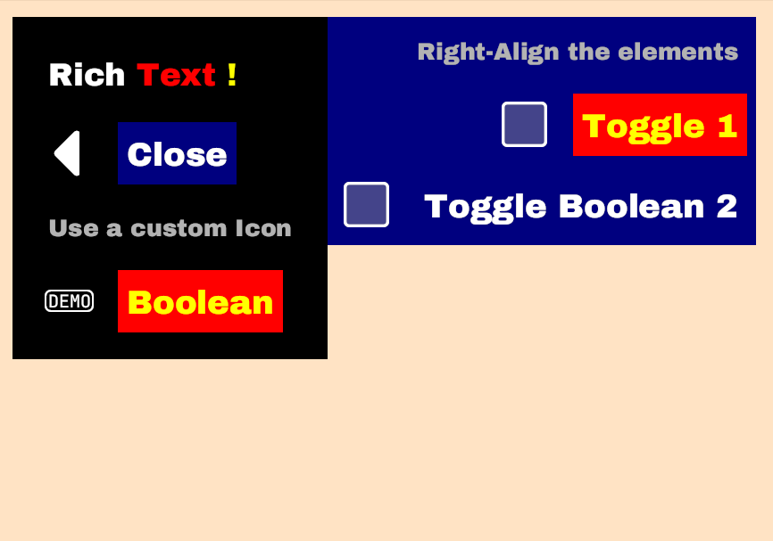

[](https://opensource.org/licenses/MIT)
[](https://docs.rs/bevy_quickmenu)
[](https://crates.io/crates/bevy_quickmenu)

# 🏃‍♂️ Bevy Quickmenu

Every game needs menus. Be it for the settings, for a pause screen, or for the main menu when the user enters the game.

While Bevy UI allows building menus, it is a cumbersome process especially if nested menus are needed. Even worse, though, is the effort required if you want your menu to be accessible with a keyboard, a gamepad, or the mouse.

Bevy Quickmenu offers all that. It is a super lightweight way of building in-game menus that can be controlled by all input devices. It even offers a simple way of having `hover` states. Everything can also be customized.

- Super simple menu plugin for bevy, building upon Bevy UI
- Keyboard, Mouse, Gamepad input is processed
- Support mouse hover states in simplified Stylesheet
- Many customizations possible (see [examples/custom.rs](examples/custom.rs))

## Usage

Add to `Cargo.toml`:

```toml
[dependencies]
bevy_quickmenu = "0.1.1"
```

## Demo


## Quick Examples

- [`examples/basic.rs`](examples/basic.rs): Basic example to show how it works
- [`examples/settings.rs`](examples/settings.rs): Full blown user settings including switching game states and showing the menu again
- [`examples/custom.rs`](examples/custom.rs): Showcase customization options

## An explanation of the required components

### `State`

A generic type that hosts the state of your menu (e.g. which items are selected, and so on).
Whenever this state changes, the menu is automatically redrawn.

## `Action`

(Conforms to `ActionTrait`): This enum defines all the actions your user can take. Such as `SoundOn`, `SoundOff` etc. When a user performs an action (by selecting the corresponding menu entry), the `handle` method is called on your `ActionTrait` implementation. `ActionTrait` has two generic types: Your `State` as well as a `Event` which you can define. This allows you to handle your action:

``` rs
#[derive(Debug, PartialEq, Eq, Clone, Copy, Hash)]
enum Actions {
    Close,
    SoundOn,
    SoundOff,
    Control(usize, ControlDevice),
}

impl ActionTrait for Actions {
    type State = CustomState;
    type Event = MyEvent;
    fn handle(&self, state: &mut CustomState, event_writer: &mut EventWriter<MyEvent>) {
        match self {
            Actions::Close => event_writer.send(MyEvent::CloseSettings),
            Actions::SoundOn => state.sound_on = true,
            Actions::SoundOff => state.sound_on = false,
            Actions::Control(p, d) => {
                state.controls.insert(*p, *d);
            }
        }
    }
}
```

## `Screen`

(Conforms to the `ScreenTrait`). Each page or screen in your menu is defined by this enum. Note that menu screens are *not nested*!. Instead the `ScreenTrait` has a `resolve` function that allows you to return the corresponding menu definition for the given enum:

``` rs
#[derive(Debug, PartialEq, Eq, Clone, Copy, Hash)]
enum Screens {
    Root,
    Controls,
    Sound,
    Player(usize),
}

impl ScreenTrait for Screens {
    type Action = Actions;
    fn resolve(&self, state: &mut CustomState) -> Menu<Actions, Screens, CustomState> {
        match self {
            Screens::Root => root_menu(state),
            Screens::Controls => controls_menu(state),
            Screens::Sound => sound_menu(state),
            Screens::Player(p) => player_controls_menu(state, *p),
        }
    }
}
```

## `Menu`

A menu is just a function that returns a list of `MenuItem` to be displayed. Each menu needs to have a distinct id. The example shows how the `root` and the `sound` menu are defined.

``` rs
fn root_menu(_state: &mut CustomState) -> Menu<Actions, Screens, CustomState> {
    Menu::new(
        Id::new("root"),
        vec![
            MenuItem::headline("Settings"),
            MenuItem::action("Back", Actions::Close).with_icon(MenuIcon::Back),
            MenuItem::screen("Sound", Screens::Sound).with_icon(MenuIcon::Sound),
            MenuItem::screen("Controls", Screens::Controls).with_icon(MenuIcon::Controls),
        ],
    )
}

fn sound_menu(state: &mut CustomState) -> Menu<Actions, Screens, CustomState> {
    Menu::new(
        Id::new("sound"),
        vec![
            MenuItem::label("Toggles sound and music"),
            MenuItem::action("On", Actions::SoundOn).checked(state.sound_on),
            MenuItem::action("Off", Actions::SoundOff).checked(!state.sound_on),
        ],
    )
}
```

## `MenuItem`

In order to give you *some* flexibility, the menu item allows you to return five different types:

- `MenuItem::label`: A small text label that cannot be selected
- `MenuItem::headline`: A big text label that cannot be selected
- `MenuItem::action`: A action that is performed when the user selects it
- `MenuItem::screen`: Dive into a screen when the user selects this
- `MenuItem::image`: A single image (including an optional `Style`)

In addition, a menu-item can have one of a couple of pre-defined icons or a custom icon

``` rs
MenuItem::screen("Controls", Screens::Controls).with_icon(MenuIcon::Controls)
MenuItem::screen("Save", Screens::Save).with_icon(MenuIcon::Other(icons.save.clone()))
```

`MenuItem`s can also be checked or unchecked:

``` rs
MenuItem::action("On", Actions::SoundOn).checked(state.sound_on)
MenuItem::action("Off", Actions::SoundOff).checked(!state.sound_on)
```

## Displaying a Menu

Here's a the annoated setup function from the example:

``` rs
impl Plugin for SettingsPlugin {
    fn build(&self, app: &mut App) {
        app
            // Register a event that can be called from your action handler
            .add_event::<BasicEvent>()
            // The plugin
            .add_plugin(QuickMenuPlugin::<BasicState, Actions, Screens>::new())
            // Some systems
            .add_startup_system(setup)
            .add_system(event_reader);
    }
}

fn setup(mut commands: Commands) {
    commands.spawn(Camera3dBundle::default());
    commands.insert_resource(MenuState::new(
        BasicState::default(),
        Screens::Root,
        Some(StyleSheet::default()),
    ))
}
```

## Removing a Menu

In order to remove a menu, there's the `bevy_quickmenu::cleanup` function. Usually, it is best
to use it with the event that Bevy Quickmenu allows you to register:

``` rs
#[derive(Debug)]
enum BasicEvent {
    Close,
}

impl ActionTrait for Actions {
    fn handle(&self, state: &mut BasicState, event_writer: &mut EventWriter<BasicEvent>) {
        match self {
            Actions::Close => event_writer.send(BasicEvent::Close),
        }
    }
}

fn event_reader(mut commands: Commands, mut event_reader: EventReader<BasicEvent>) {
    for event in event_reader.iter() {
        match event {
            BasicEvent::Close => bevy_quickmenu::cleanup(&mut commands),
        }
    }
}
```

### Screenshot from the customized screen


